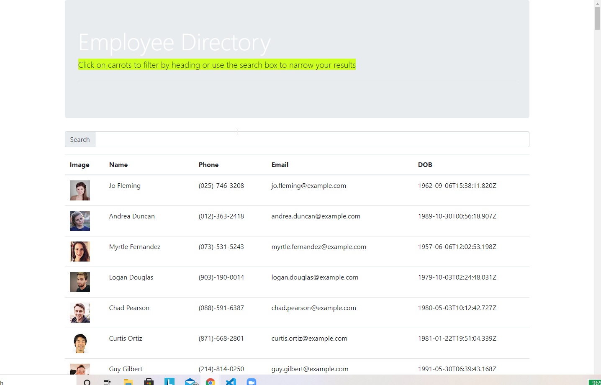

# Employee-Directory

  

## Description
 This application will allow you to search and sort through a table of employees.
 ## Table of Contents

 * [Installation](#installation)
 * [Usage](#usage)
 * [License](#license)
 * [Contributing](contributing)
 * [Tests](tests)
 * [Questions](questions)

 ## Installation
 npm start
 ## Usage
 for current class
 ## License
 mit
 ## Contributing
 
 ## Tests
 npm test
 ## Questions
 Direct all questions to ccollins36@icloud.com

 
